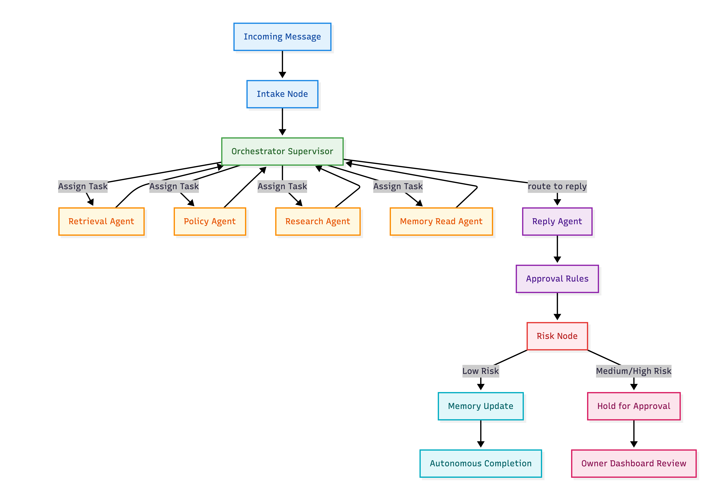

<div align="center">

# One-Man-Business Multi-Agent Orchestrator System


**A supervisor-driven, role-aware multi-agent system for solo business operations**

It handles stakeholder conversations across web and Telegram, grounds replies in business data and policy, and routes risky responses to human approval instead of sending them blindly.

<p>
  <a href="#quick-start"><strong>Quick Start</strong></a> ·
  <a href="#architecture-at-a-glance"><strong>Architecture</strong></a> ·
  <a href="#repository-guide"><strong>Repository Guide</strong></a> ·
  <a href="#testing-and-evaluation"><strong>Testing</strong></a>
</p>

</div>



## Highlights

| Capability | What it means here |
| --- | --- |
| **Role-aware access** | Different stakeholder types see different tools and data paths |
| **Supervisor orchestration** | A central orchestrator delegates work to retrieval, policy, research, memory, and reply agents |
| **Risk-governed replies** | Sensitive or high-stakes responses are held for approval instead of auto-sent |
| **Hybrid operations UI** | Next.js dashboard + Supabase + protected backend endpoints |
| **Multi-channel messaging** | Supports both Telegram webhook flow and web-based chat flows |

## Quick links

- **Run with Docker:** [`docker compose up -d --build`](#2-start-with-docker-recommended)
- **Run the backend locally:** [`uv run uvicorn backend.main:app --host 0.0.0.0 --port 8000`](#backend)
- **Run the frontend locally:** [`npm run dev`](#frontend)
- **Reset the seed dataset:** [`uv run python backend/db/reset_and_seed_supabase.py`](#reset-and-seed-the-database)
- **Read the paper:** [`paper/paper.tex`](paper/paper.pdf)

## Overview

This project combines a FastAPI backend, a Next.js dashboard, Supabase/Postgres, and a LangGraph-based orchestration pipeline to help a single business owner manage conversations across multiple stakeholder roles.

It is designed around four ideas:

- **Role-aware access control** — customers, suppliers, partners, investors, and owners should not see the same data.
- **Supervisor-style orchestration** — one orchestrator delegates work to specialized agents for retrieval, policy, research, memory, and reply generation.
- **Risk-governed automation** — high-stakes replies are held for approval instead of being sent automatically.
- **Human-in-the-loop operations** — the owner remains the final decision maker for risky business communication.

The accompanying paper in [`paper/paper.pdf`](paper/paper.pdf) describes the architectural rationale, risk model, and evaluation framing in more detail.

### Why this project is interesting

Most LLM chat systems stop at “generate a reply.” This one adds business-critical control layers around that generation step:

- **retrieval grounded in internal business data**
- **policy checking before delivery**
- **memory across conversations**
- **approval gating for risky outputs**
- **a real dashboard + webhook integration around the agent pipeline**

## What this repository contains

- **Backend** — FastAPI application and LangGraph pipeline under [`backend/`](backend)
- **Frontend** — Next.js 16 owner/stakeholder dashboards under [`frontend/`](frontend)
- **Data layer** — Supabase PostgreSQL schema, seed scripts, and Supabase Auth integration
- **Integrations** — Telegram webhook + sender, OpenAI/Gemini provider support, Tavily research, optional Langfuse tracing
- **Tests and evals** — unit tests, integration tests, and retrieval/policy evaluation scripts under [`tests/`](tests)

## Architecture at a glance

At a high level, the runtime flow is:

1. A message enters from **Telegram** or the **web app**.
2. FastAPI normalizes the request and invokes the **LangGraph pipeline**.
3. The **intake node** resolves identity, thread context, and memory.
4. The **orchestrator** decides which sub-agents to call.
5. Specialized agents perform **retrieval**, **policy evaluation**, **external research**, and **memory lookup**.
6. A **reply agent** drafts the response.
7. **Approval rules** and **risk checks** decide whether to:
   - auto-send the reply, or
   - hold it for owner approval.
8. Approved replies and memory updates are persisted back to Supabase/Postgres.

### End-to-end system flow

```text
Telegram / Web UI
        │
        ▼
FastAPI ingress + Next.js route handlers
        │
        ▼
LangGraph pipeline.invoke(...)
        │
        ├── Intake node
        │     └── identity resolution + thread context + memory context
        │
        ├── Orchestrator supervisor
        │     └── decides which sub-agents to fan out to
        │
        ├── Retrieval agent   ─┐
        ├── Policy agent      ─┼─► completed task results
        ├── Research agent    ─┤
        └── Memory read node  ─┘
                    │
                    ▼
              Reply agent
                    │
                    ▼
        Approval rules + Risk evaluation
             ├── low risk  ─► auto-send
             └── flagged   ─► hold for owner approval
```

### Technical component map

| Layer | Primary responsibility | Main implementation |
| --- | --- | --- |
| **Ingress** | Receive web and Telegram messages | [`backend/main.py`](backend/main.py), [`backend/integrations/telegram_webhook.py`](backend/integrations/telegram_webhook.py), [`frontend/src/app/api/owner-chat/send/route.ts`](frontend/src/app/api/owner-chat/send/route.ts) |
| **Orchestration** | Build and run the multi-agent pipeline | [`backend/graph/pipeline_graph.py`](backend/graph/pipeline_graph.py), [`backend/graph/state.py`](backend/graph/state.py) |
| **Supervisor** | Task planning, routing, replanning | [`backend/agents/orchestrator_agent.py`](backend/agents/orchestrator_agent.py) |
| **Agents** | Retrieval, policy grounding, research, memory, reply generation | [`backend/agents/`](backend/agents) |
| **Risk + approval** | Gate sensitive replies before delivery | [`backend/nodes/approval_rules.py`](backend/nodes/approval_rules.py), [`backend/nodes/risk.py`](backend/nodes/risk.py), [`backend/services/approval_service.py`](backend/services/approval_service.py) |
| **Data** | Profiles, messages, memory, policy chunks, approvals | [`backend/db/models.py`](backend/db/models.py), [`backend/db/`](backend/db) |
| **Frontend ops layer** | Dashboard, approvals UI, protected server routes | [`frontend/src/app/`](frontend/src/app), [`frontend/src/app/api/approvals/route.ts`](frontend/src/app/api/approvals/route.ts) |
| **External integrations** | Supabase, Telegram, OpenAI/Gemini, Tavily, Langfuse | [`backend/config.py`](backend/config.py), [`backend/services/supabase_client.py`](backend/services/supabase_client.py) |

### Why the architecture is technically interesting

- **The LLM is not the system boundary** — orchestration, approval gating, and persistence live outside the model.
- **The pipeline is explicit** — request flow is encoded as graph nodes and transitions instead of hidden inside one agent prompt.
- **Risk is a first-class stage** — risky outputs are intercepted before delivery, not post-hoc.
- **The system is operational, not toy-grade** — it includes dashboard routes, seeded accounts, webhook handling, persistence, and tests.

## Methodology

The README previously described the system architecture, but the paper adds a more specific methodological framing. In this project, the methodology is not just “use multiple agents” — it is a **rule-first, prompt-second** orchestration design for trust-sensitive business communication.

### Methodology in one view

| Methodology element | What it means in this project |
| --- | --- |
| **Supervisor-based orchestration** | A central orchestrator decomposes requests into specialized sub-tasks instead of relying on one unconstrained LLM pass |
| **Synthesis-over-delegation** | The orchestrator uses completed results to inform later actions, reducing vague or hallucinated task routing |
| **Rule-first guardrails** | Safety-critical constraints such as role boundaries and approval triggers are enforced in infrastructure and workflow logic, not only in prompts |
| **Hybrid retrieval methodology** | Internal business data, policy grounding, external research, and memory are treated as separate evidence sources |
| **Two-layer risk governance** | A deterministic rule layer runs first, followed by semantic LLM review for ambiguous medium-risk cases |
| **Human-in-the-loop control** | Medium/high-risk replies are held for owner approval instead of being sent automatically |
| **Harness engineering** | Fault containment, bounded replanning, structured outputs, and fallback behavior are used to limit downside risk |

### Core methodological principles from the paper

#### 1) Supervisor-based planning instead of single-pass generation

The paper frames the system as a **supervisor-based multi-agent architecture** built on LangGraph. Incoming messages are first interpreted, then decomposed into tasks for retrieval, policy evaluation, research, memory, and reply generation.

This matters because it separates:

- planning,
- information gathering,
- policy grounding,
- reply drafting,
- and risk evaluation.

That separation makes the system more auditable and easier to control than a single-agent chat pipeline.

#### 2) Rule-first, prompt-second safety design

One of the most important methodological ideas from the paper is that **security and governance should not rely only on prompt wording**.

In this project, prompts are used where judgment is useful, but hard constraints are enforced elsewhere:

- role-based access is enforced through tool/data boundaries,
- approval gates are part of the workflow,
- risk checks run after reply generation,
- and structured outputs constrain what each stage can emit.

This follows the paper’s central position: use the model for language and nuanced reasoning, but use the system architecture for safety boundaries.

#### 3) Three-layer context methodology

The paper describes the system as using a **three-layer memory architecture**:

- **short-term memory** for recent conversation context,
- **durable memory** for long-term facts and preferences,
- **sender-specific memory/profile context** for role- and person-aware behavior.

This is a methodological choice, not just an implementation detail: it keeps replies contextual while controlling prompt size and preserving long-term consistency.

#### 4) Hybrid evidence gathering instead of one retrieval path

The methodology separates several evidence channels:

- **retrieval agent** for internal business data,
- **policy agent** for grounded policy decisions,
- **research agent** for external information,
- **memory read/update logic** for conversation continuity.

This helps the system distinguish between:

- internal facts,
- policy constraints,
- external market/context information,
- and relationship/history context.

#### 5) Two-layer risk governance

The paper emphasizes that all outgoing replies pass through a **two-layer risk evaluation pipeline**:

1. **Deterministic checks first** — regex/policy-style checks for commitments, disclosure, escalation triggers, low-confidence signals, and other explicit violations.
2. **Semantic LLM review second** — only for ambiguous or medium-risk cases, where the model checks implied commitments, contradictions, or contextual tone issues.

This is methodologically important because it reserves LLM judgment for ambiguous cases instead of using it as the only guardrail.

#### 6) Human oversight as part of the system design

The paper does not treat approval as a UI convenience; it treats it as a core methodological control. Replies with elevated risk are persisted and surfaced for dashboard review, allowing the owner to approve or reject before delivery.

That makes the system a **collaborative decision system**, not a fully autonomous black box.

### How the paper and implementation line up

The methodology described in [`paper/paper.pdf`](paper/paper.pdf) maps directly to the implementation:

- **LangGraph supervisor workflow** → [`backend/graph/pipeline_graph.py`](backend/graph/pipeline_graph.py)
- **orchestrator planning** → [`backend/agents/orchestrator_agent.py`](backend/agents/orchestrator_agent.py)
- **intake + identity resolution** → [`backend/nodes/intake.py`](backend/nodes/intake.py)
- **risk + approval flow** → [`backend/nodes/approval_rules.py`](backend/nodes/approval_rules.py), [`backend/nodes/risk.py`](backend/nodes/risk.py), [`backend/services/approval_service.py`](backend/services/approval_service.py)
- **database-backed memory and messaging** → [`backend/db/models.py`](backend/db/models.py)

> [!NOTE]
> If you want the full academic framing — including decision-theoretic reasoning, harness engineering, fairness/responsibility discussion, and evaluation notes — read [`paper/paper.pdf`](paper/paper.pdf). The README focuses on the implementation-facing version of that methodology.

Key implementation files:

- App entry: [`backend/main.py`](backend/main.py)
- API + pipeline trigger: [`backend/api/router.py`](backend/api/router.py)
- Telegram webhook: [`backend/integrations/telegram_webhook.py`](backend/integrations/telegram_webhook.py)
- Pipeline graph: [`backend/graph/pipeline_graph.py`](backend/graph/pipeline_graph.py)
- Pipeline state: [`backend/graph/state.py`](backend/graph/state.py)
- Supervisor/orchestrator: [`backend/agents/orchestrator_agent.py`](backend/agents/orchestrator_agent.py)
- Approval persistence: [`backend/services/approval_service.py`](backend/services/approval_service.py)
- Schema/models: [`backend/db/models.py`](backend/db/models.py)

> [!NOTE]
> The frontend is intentionally **hybrid**: some dashboard data is read directly from Supabase, while chat and approval actions go through protected backend endpoints.

## Quick start

### Prerequisites

- Python **3.11+**
- Node.js (for frontend development)
- Docker Desktop + Docker Compose
- [`uv`](https://docs.astral.sh/uv/) for local Python workflows
- A Supabase project and database connection string
- At least one LLM provider key: OpenAI or Gemini

### 1) Configure the environment

```bash
cp .env.example .env
```

Update `.env` with your own values.

Minimum important variables:

- `SUPABASE_DB_URL`
- `NEXT_PUBLIC_SUPABASE_URL`
- `NEXT_PUBLIC_SUPABASE_PUBLISHABLE_KEY`
- `SUPABASE_SERVICE_ROLE_KEY`
- `INTERNAL_API_KEY`
- `BACKEND_PUBLIC_URL`
- `AI_PROVIDER`
- `OPENAI_API_KEY` or `GOOGLE_API_KEY`

> [!IMPORTANT]
> For Docker/production-style frontend builds, `NEXT_PUBLIC_*` values must be present **at build time** because they are baked into the Next.js bundle.

### 2) Start with Docker (recommended)

```bash
docker compose up -d --build
```

Services:

- Frontend: http://localhost:3000
- Backend: http://localhost:8000
- Backend docs: http://localhost:8000/docs
- Backend health: http://localhost:8000/health

Useful commands:

```bash
# Follow logs
docker compose logs -f backend frontend

# Stop everything
docker compose down

# Rebuild after changes
docker compose up -d --build
```

## Local development

### Backend

Install Python dependencies:

```bash
uv sync
```

Run the API:

```bash
uv run uvicorn backend.main:app --host 0.0.0.0 --port 8000
```

### Frontend

Install frontend dependencies:

```bash
npm install --prefix frontend
```

Run from the repo root so the shared `.env` is loaded:

```bash
npm run dev
```

If you prefer running inside `frontend/`, create `frontend/.env.local` first and then use the local package scripts.

## Reset and seed the database

To wipe business data and reload the deterministic seed set:

```bash
uv run python backend/db/reset_and_seed_supabase.py
```

This script:

- applies the current schema updates
- wipes and recreates business data tables
- recreates owner profiles and default memory/rule context
- regenerates seed CSVs
- reloads seeded owners and stakeholder accounts into Supabase

Seeded auth users include two owners plus three customers, suppliers, partners, and investors for each owner.

Example accounts:

- `owner1@gmail.com`
- `owner2@gmail.com`
- `customer1A@gmail.com`
- `supplier1A@gmail.com`
- `partner1A@gmail.com`
- `investor1A@gmail.com`

Default seeded password:

```text
Abcd@1234
```

See [`backend/db/Database_guide.md`](backend/db/Database_guide.md) for the full seeded account list and reset behavior.

## Telegram setup

Telegram is configured from the owner dashboard under **Profile → Telegram Integration**.

You provide:

- Bot token
- Webhook secret

The application constructs the webhook URL from:

```text
${BACKEND_PUBLIC_URL}/api/v1/telegram/webhook
```

When the owner profile is saved with both Telegram fields present, the app re-registers the webhook automatically.

## Repository guide

```text
.
├── backend/         FastAPI app, LangGraph pipeline, agents, DB scripts
├── frontend/        Next.js app, dashboards, route handlers, Supabase clients
├── paper/           Project paper and architecture figures
├── tests/           Unit tests, integration tests, evaluation scripts
├── docker-compose.yml
├── Dockerfile
├── pyproject.toml
└── .env.example
```

If you are new to the codebase, start here:

- [`backend/main.py`](backend/main.py) — app entrypoint
- [`backend/api/router.py`](backend/api/router.py) — API routes and pipeline invocation
- [`backend/graph/pipeline_graph.py`](backend/graph/pipeline_graph.py) — overall orchestration flow
- [`backend/agents/orchestrator_agent.py`](backend/agents/orchestrator_agent.py) — supervisor logic
- [`backend/services/approval_service.py`](backend/services/approval_service.py) — hold/approve/reject lifecycle
- [`frontend/src/app/api/owner-chat/send/route.ts`](frontend/src/app/api/owner-chat/send/route.ts) — frontend-to-backend chat bridge
- [`frontend/src/app/api/approvals/route.ts`](frontend/src/app/api/approvals/route.ts) — approval actions from the dashboard

## Testing and evaluation

Install dev dependencies if you want the local Python test tooling:

```bash
uv sync --extra dev
```

Run the test suite:

```bash
uv run pytest
```

The repository also includes targeted evaluation scripts for retrieval and policy behavior under [`tests/retrieval_agent/`](tests/retrieval_agent) and [`tests/policy_agent/`](tests/policy_agent).

## Project paper and supporting materials

- Paper source: [`paper/paper.tex`](paper/paper.tex)
- Architecture figure: [`paper/mermaid.png`](paper/mermaid.png)
- Detailed architecture draft used during development: [`corrected_system_architecture_mermaid.txt`](corrected_system_architecture_mermaid.txt)

The paper frames the system as a **supervisor-based multi-agent architecture** for solo entrepreneurs, with **role-aware retrieval**, **policy grounding**, **three-layer memory**, and **risk-governed approval flows**.

## Operational notes

> [!WARNING]
> `INTERNAL_API_KEY` is required in production for protected frontend → backend server-to-server calls.

> [!TIP]
> Docker startup does **not** automatically reset or reseed the database. Run the seed script manually when you need a clean dataset.
